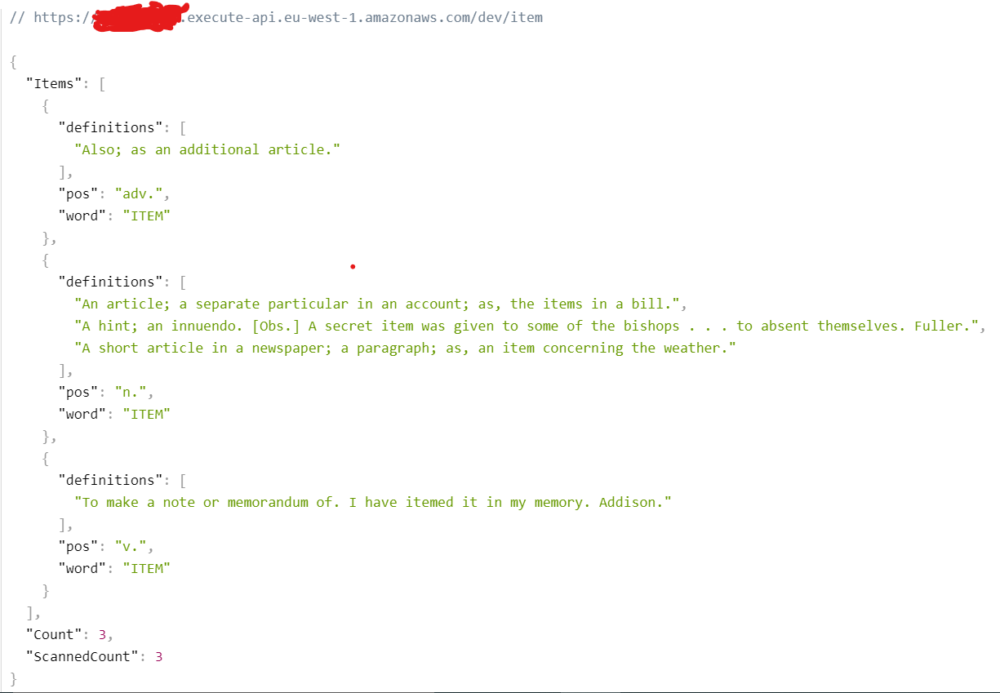

## My app -

---

### Front-side - To be continued

### Server-side 💻-

- **A server built using the expressJS directory.**
- **Served with the serverless-http package as a Lambda function.**
- **The lambda function invoke by the Api-Gateway service.**
- **All configuration of the aws services was done with the help of the serverless framework in order to upload everything as a CloudFormation stack.**

### Features -

- **Over 100,000 words!**
- **Search by word and get all its definitions in the different parts of speech.**
- **Search by word and part of speech desired.**
- **Receiving a random word in a particular part of speech.**
- **Receive a random word in a particular part of speech that contains a letter or letter combination of your choice.**

### Future

- **ErrorHandler to server**

---

## Global use - 🌎

### [My server to get JSON answers](https://moj90vlvy0.execute-api.eu-west-1.amazonaws.com/dev)

- **The backend works with -  1. DynamoDB to store data.  2. The app by REST API (API Gateway) in conjunction with Lambda serverless function.**

## Local use - 📌

### Github

- **Clone this repo**
- **Run `npm i`on the `backend` dir - To install all the dependencies**

#### To seed the DB -

- **Download the AWS CLI and configure your details**
- **Create a table on dynamoDB and switch the `TABLE_NAME` in `utils\constants.js`**
- **Create `.env` file and save -   1. Access_key_ID = ?, 2. Secret_access_key = ?**
- **Run `node /backend/utils/seed-db/index` to start seeding your table (This may take some time)**

#### To upload the backend as lambda

- **[Download serverless](https://www.serverless.com/framework/docs/getting-started)**
- **Run `serverless deploy` on `backend` dir.**

#### To run the app

- **Back- To run local run `sls offline start` (On PORT=3000)**

---

## Screenshots -

## Back JSON results:

### Routes:

- **`"BASE_URL/:word"` - For the result of a word search - all parts of speech**
- **`"BASE_URL/:word/:partOfSpeech"` - For a result of a word search - in a specific parts of speech**
- **`"BASE_URL/part-of-speech/:part"` - Receiving a random word in a specific parts of speech**
- **`"BASE_URL/part-of-speech/:part?letter=a"` - Receiving a random word in a specific parts of speech that contain specific letter / letter combination**

### `BASE_URL/item` result:

### 

### `BASE_URL/item/n.` result:

### 

### `BASE_URL/part-of-speech/v.` result:

### 

### `BASE_URL/part-of-speech/verbs?letter=b` result:

### 

---

## Assignment - backend

Your about to build an english dictionary app

1. Download [English Dictionary in CSV format](https://www.bragitoff.com/2016/03/english-dictionary-in-csv-format/)
2. [x] Set up a DynamoDB with `dictionary` table
3. [x] **DATABASE:**
   1. [x] Parse & Insert all words, in a common structure, to `dictionary` table
4. [x] **BACKEND:**
   1. build a REST API with the following end point(s):
      1. [x] `GET /:word` - if word has more than one parts of speech will return all words part of speech, else, will return a word + definition + part of speech.
      2. [x] `GET /:word/:partOfSpeech` - will return a word + definition + part of speech [(noun, verb, adjectives, etc...)](https://www.dictionary.com/e/parts-of-speech/)
      3. [x] `GET /part-of-speech/:part` - for example, `/part-of-speech/adjective`, will return a random word + definition + part of speech (`part` is enum)
      4. [x] `GET /part-of-speech/:part?letter=X` - for example, `/part-of-speech/noun?letter=m`, will return a random word with the same letter + definition + part of speech
   2. [x] **BONUS**: should be deployed as `lambda function`
